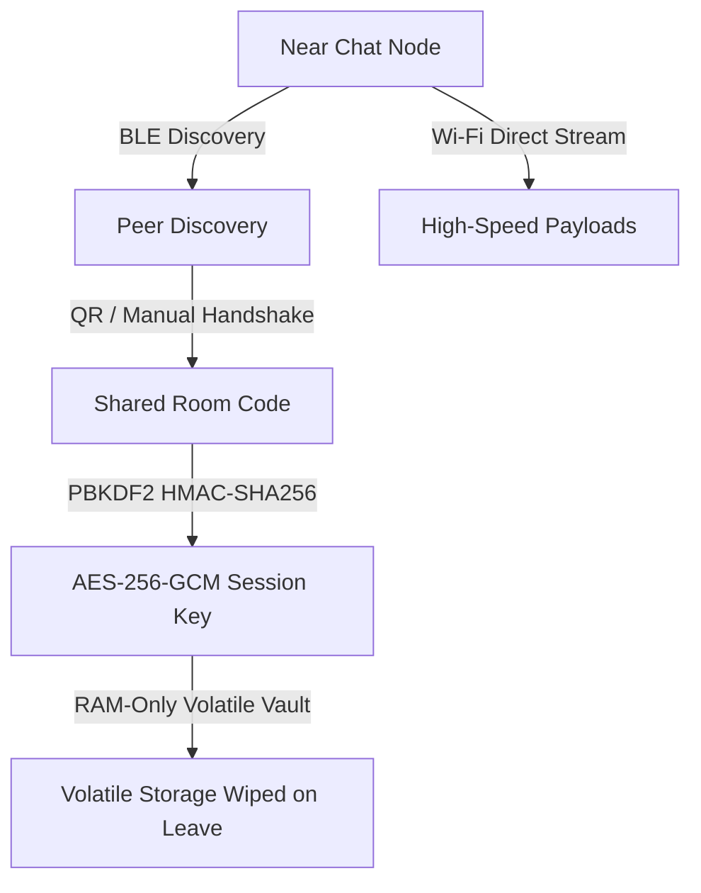

# 🌐 Near Chat — Decentralized P2P Mesh Protocol

[](https://flutter.dev)
[-3DDC84?style=for-the-badge&logo=android&logoColor=white)](https://developer.android.com)
[](#cryptographic-vault)
[](#mesh-protocol)

**Near Chat** (NearNode) is a zero-latency, off-grid communication framework built for environments with zero cellular coverage or internet connectivity. Powered by local Bluetooth and high-speed Wi-Fi cluster mesh technology, it guarantees 100% decentralized, end-to-end encrypted messaging, media streaming, and peer discovery.

---

## 📥 Direct App Download

Get the latest production-ready Android APK directly and start chatting off-grid immediately:

<div align="center">
  <a href="https://drive.google.com/file/d/1mOS7ePOzuNUMpw77jtI3T_orJxjQyVzS/view?usp=sharing" target="_blank">
    
  </a>
</div>

---

## 📸 App Showcase

<div align="center">
  <table border="0">
    <tr>
      <td align="center"><b>1. Discover Peers</b></td>
      <td align="center"><b>2. Enter Room</b></td>
      <td align="center"><b>3. Off-Grid Chat</b></td>
    </tr>
    <tr>
      <td></td>
      <td></td>
      <td></td>
    </tr>
    <tr>
      <td align="center"><b>4. App Settings</b></td>
      <td align="center"><b>5. Profile Setup</b></td>
      <td align="center"><b>6. Interactive Home</b></td>
    </tr>
    <tr>
      <td></td>
      <td></td>
      <td></td>
    </tr>
  </table>
</div>

---

## ⚡ Core Features

*   **100% Offline Messaging**: Communicate locally without mobile data, cellular towers, servers, or active internet connections.
*   **Media & File Sharing**: High-bandwidth offline channel streams images and voice notes directly over peer-to-peer Wi-Fi channels.
*   **QR-Code Instapair**: Generate and scan room code QR cards to automatically establish secure peer channels and exchange handshake data instantly.
*   **Shake to Broadcast**: Triggered via device accelerometer. A rapid physical shake activates emergency broadcast mode, setting up a session, copying the code to the clipboard, and sending beacons.
*   **Premium Glassmorphic UI**: Beautifully optimized Light/Dark themes wrapped in premium frosted-glass visual layers (`BackdropFilter` with blur effects) matching modern visual aesthetics (inspired by Telegram's dynamic styling).
*   **Acoustic & Tactile Chimes**: custom clickless sine-wave notification sound effects (ascending sent chime, descending received chime) with built-in 15% linear amplitude envelopes to prevent pops, combined with medium impact haptic responses.

---

## ⚙️ Technical Specifications & Architecture



### 📡 Mesh Protocol
*   **Strategy**: `P2P_CLUSTER` via Google's Nearby Connections API.
*   **Discovery**: Bluetooth Low Energy (BLE) advertised beacons allow zero-power device discovery and background mapping.
*   **Transport**: Automatic promotion to Wi-Fi Direct (Wi-Fi P2P) and high-speed local sockets for high-bandwidth media streaming.
*   **Lexicographical Collision Resolution**: Deterministically resolves simultaneous connection requests (Google API Error `8012`) by comparing peer usernames to choose the initiator.
*   **Offline Outbox Sync**: In-flight queues cache outbox frames during momentary radio fade out and automatically flush data once peer connection re-establishes.

### 🔒 Cryptographic Vault
*   **Encryption Standard**: Symmetric **AES-256-GCM** (Galois/Counter Mode) secures all communication frames, providing authenticated encryption and tamper protection.
*   **Key Derivation**: Session keys are derived locally using **PBKDF2** with a **SHA-256 HMAC** (100,000 iterations) from the shared 6-digit Room Code. No keys or master codes are ever transmitted over the air.
*   **Zero-Trace Ephemeral Storage**: Volatile memory design. Messages, decrypted media, and keys are held strictly in RAM. Exiting a room or closing the application triggers a security sweep that permanently clears all session details with zero local disk footprint.

---

## 📱 Hardware & Permission Requirements

To set up local ad-hoc networks without server infrastructure, Near Chat requests the following hardware capabilities:

*   **Near-Field Radios**: Bluetooth (BLE discovery/handshake) and Wi-Fi (ad-hoc streaming socket).
*   **Fine Location**: Required by Android & iOS to perform local BLE scans.
*   **Nearby Devices Permission**: Android 13+ permission for offline local network device discovery without location access.
*   **Microphone**: Record offline voice notes.
*   **Camera**: High-speed QR scanning for secure instant pairing.

---

## 🛠️ Build & Installation

### Prerequisites
*   [Flutter SDK](https://flutter.dev/docs/get-started/install) (v3.6.2 or higher)
*   [Dart SDK](https://dart.dev/tools/sdk) (v3.6.2 or higher)
*   Android SDK (API Level 21+) or iOS SDK (iOS 12.0+)

### Setup Instructions
1.  Clone the repository:
    ```bash
    git clone https://github.com/Jayanth0923/Near-Chat.git
    cd Near-Chat
    ```
2.  Install dependencies:
    ```bash
    flutter pub get
    ```
3.  Analyze codebase:
    ```bash
    flutter analyze
    ```
4.  Run on connected emulator or physical device:
    ```bash
    flutter run
    ```
5.  Build release APK:
    ```bash
    flutter build apk --release
    ```

---

## 🤝 Support & Donate
Near Chat is developed by **Jayanth Muddulur** as a final-year project at RMKCET ('26). 

If you find this decentralized mesh project helpful, consider supporting:
*   **Developer Website**: [ferrypot.in](https://ferrypot.in)
*   **UPI ID**: `jayanthmuddulurt2004-1@oksbi`
